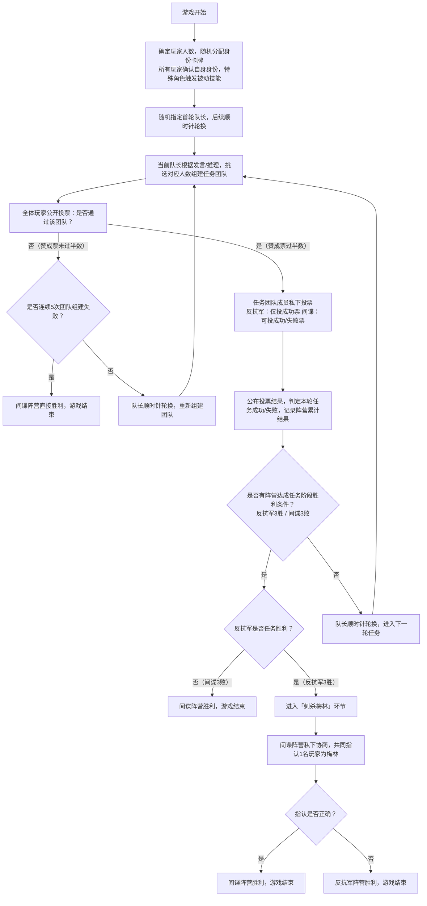

该境外网页当前无法访问，结合《抵抗组织：阿瓦隆》的通用标准规则，为你总结核心游戏规则并编写可视化流程图，该版本在基础抵抗组织玩法上新增**角色技能**和**梅林验身**核心机制，阵营对抗更具策略性，适合5-10人游玩。

# 抵抗组织：阿瓦隆 核心游戏规则总结
《抵抗组织：阿瓦隆》是基础版抵抗组织的经典扩展版，核心仍为**反抗军完成3个任务、间谍破坏3个任务**的阵营博弈，新增**特殊身份角色**和**梅林投票刺杀**环节，间谍阵营胜利方式分为两种，游戏趣味性和策略性大幅提升。
## 一、核心阵营与身份角色
游戏分为**好人阵营（反抗军）**和**坏人阵营（莫德雷德的爪牙/间谍）**，除基础平民/普通间谍外，双方均有带技能的特殊角色，**不同人数局角色配置不同**（以5人局为基础参考）。
### 好人阵营（反抗军）
核心目标：完成3个团队任务 + **保护梅林不被间谍刺杀**
- **梅林**：核心领袖，开局可看到**所有间谍的身份**（莫德雷德除外），无直接操作技能，需暗中引导反抗军选对队员，全程需隐藏身份。
- **派西维尔**：能看到**梅林和莫甘娜**的身份，但无法区分二人，需通过发言推理真实梅林。
- **普通反抗军/平民**：无特殊技能，仅知晓自身身份，需跟随梅林/派西维尔的引导完成任务。

### 坏人阵营（间谍）
核心目标：破坏3个团队任务 **OR** 刺杀成功真正的梅林（任务结束后若未分胜负，触发刺杀环节）
- **莫甘娜**：伪装成梅林的间谍，会被派西维尔看到，用于混淆派西维尔的判断。
- **莫德雷德**：隐藏的间谍，**梅林无法看到其身份**，是间谍阵营的核心隐藏牌。
- **普通间谍**：无特殊技能，知晓所有队友身份，可混入任务团队投失败票。
- **奥伯伦**：孤立的间谍，不知晓队友身份，队友也看不到他（部分版本可选角色，非核心）。

## 二、基础配置与任务参数
1. **人数要求**：5-10人，**角色配置随人数动态调整**（例：5人局为「梅林+派西维尔+3平民」vs「莫甘娜+莫德雷德」；6人局新增1名普通间谍）。
2. **任务参数**：每轮任务的**团队人数**和**失败票阈值**为固定标准（不同人数局仅微调），核心规则：
   - 共进行5轮任务，率先完成3个任务的阵营获得阶段优势；
   - 任意1张失败票即可破坏任务（部分高人数局第4轮需2张失败票）；
   - 团队投票若**连续5次组建失败**，直接判定间谍阵营胜利。

## 三、核心游戏流程
游戏分为**任务执行阶段**和**刺杀梅林阶段**（仅任务阶段未分胜负时触发），全程无玩家淘汰，通过**发言推理、技能隐藏、团队投票**完成博弈，特殊角色技能均为**开局被动触发**（无主动使用操作）。

# 抵抗组织：阿瓦隆 游戏流程流程图
## 可视化Mermaid流程图（可直接渲染）
支持Markdown的平台（如Typora、GitBook）可直接复制渲染，也可作为手绘/办公软件制图的参考，**严格遵循阿瓦隆标准流程**，包含角色分配、任务执行、刺杀梅林全环节：

## 简易文字流程图（快速梳理/手绘版）
1. 游戏开始→人数确认→随机发身份→特殊角色触发技能（梅林看间谍、派西维尔看梅莫二人）
2. 指定首轮队长→队长组建任务团队→全体公开投票
3. 投票不通过→判断是否连续5次失败：是则间谍胜，否则轮换队长重新组建
4. 投票通过→任务团队私下投票→公布结果，记录累计胜败
5. 判断任务阶段胜负：
   - 间谍3败→间谍胜，游戏结束
   - 反抗军3胜→进入刺杀梅林环节
   - 均未达成→轮换队长，进入下一轮任务
6. 刺杀梅林环节：间谍私下指认梅林→指认正确则间谍胜，错误则反抗军胜

# 关键规则补充（阿瓦隆核心特色）
1. **技能触发规则**：所有特殊角色的技能均为**开局一次性被动触发**，游戏过程中无额外技能使用，梅林/派西维尔仅能通过发言间接引导，不可直接暴露身份。
2. **刺杀梅林规则**：该环节为反抗军任务胜利后的**专属决胜环节**，是间谍阵营的“翻盘机会”，仅间谍阵营参与投票指认，反抗军无参与权。
3. **身份隐藏规则**：莫德雷德对梅林**完全隐藏**，莫甘娜对派西维尔**伪装梅林**，是游戏核心的推理博弈点。
4. **团队投票规则**：投票为**公开举手/表态**，玩家可通过投票行为推理他人身份，是重要的信息获取环节。
